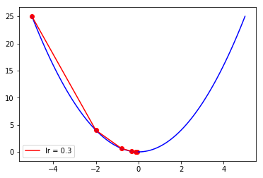
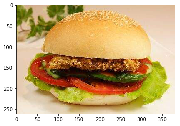
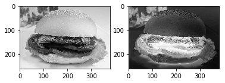

# DL 中常用的Python库
## Numpy 操作  
  &emsp; Numpy(Numerical Python extension)是一个第三方的Python包，主要用于科学计算。

#### array模块


```python
# array 的基本操作
import numpy as np 
a = [1, 2, 3, 4]         # a是python中的list类型
b = np.array(a)          # 数组化之后的b的类型变为 array
print(type(b))                  # b的类型为<numpy.ndarray>

print(b.shape)                  # shape 参数表示 array 的大小，这里是4
print(b.argmax())               # 调用argmax() 函数可以求得 array 中的最大索引值，这里是3
print(b.max())                  # 调用max() 函数可以求得array 中的最大值，这里是4
print(b.mean())                 # 调用min() 函数可以求得array 中的平均值，这里是2.5
```


```python
# NumPy 中实现矩阵转置
import numpy as NumPy
# 使用arange() 函数创建数值范围并返回 ndarray对象
# 使用reshape() 函数在不改变数值类型的情况下修改数组形状
x = np.array(np.arange(12).reshape(3,4))
print(x)
# 使用transpose() 函数进行矩阵转置操作
t = x.transpose()
print(t)
```


```python
# NumPy 基础数学运算
import numpy as NumPy

# 绝对值
a = np.abs(-1)

# sin 函数
b = np.sin(np.pi/2)

# tanh 逆函数
c = np.arctanh(0.462118)

# e 为底的指数函数
d = np.exp(3)

# 2的3次方
f = np.power(2,3)

# 点积 1*3+2*4
g = np.dot([1,2],[3,4])

# 开方
h = np.sqrt(25)

# 求和
i = np.sum([1,2,3,4])

# 平均值
j = np.mean([4,5,6,7])

# 标准差
p = np.std([1,2,3,2,1,3,2,0])

print(a, b, c, d, f, g, h, i, j, p)
```

#### random 模块

  &emsp;随机模块可以方便地做一些快速模拟去验证结论，在神经网络中也能够做一些快速的网络构造。


```python
import numpy as np

# 设置随机数种子
np.random.seed(42)     #作用：使得随机数据可预测，即只需要随机数seed的值一样，后续生成的随机数都一样。

# 产生一个1*3，[0,1]之间的浮点数随机数
np.random.rand(1,3)

# 产生一个[0，1]之间的浮点型随机数
np.random.random()

# 从a中有放回地随机采样7个
a = np.array([1,2,3,4,5,6,7])
np.random.choice(a,7)

# 从a中无放回地随机采样7个
np.random.choice(a,7,replace=False)

# 对a进行乱序并返回一个新的array
b = np.random.permutation(a)

# 生成一个长读为9的随机bytes序列并作为str返回
np.random.bytes(9)

```

#### 广播机制
  &emsp; 对于array，默认执行对位运算。涉及多个array的对位运算需要array的维度不一致，如果一个array的维度与另外一个array的维度不一致，则在没有对齐的维度上分别进行对位运算，这种机制称为广播（Broadcasting）。


```python
# 广播机制的理解
import numpy as np

a = np.array([
    [1, 2, 3],
    [4, 5, 6]
])

b = np.array([
    [1, 2, 3],
    [1, 2, 3]
])

# a 与 b 维度一样，对位运算
print(a + b)

c = np.array([
    [1, 2, 3],
    [4, 5, 6],
    [7, 8, 9]
])

d = np.array([
    [1, 2, 3]
])

# c 与 d维度不同，广播机制
# d 和 c的每一行分别计算
print(c + d)

```

#### 向量化
  &emsp; 向量化是提升计算效率的主要手段之一，对于在机器学习中缩短每次训练的时间具有重要意义，当可用工作时间不变的情况下，更短的单次训练时间可以让程序员有更多的测试机会，进而更快、更好地调整神经网络的结构和参数。


```python
# 导入库和数据初始化
import numpy as np 
import time 

# 初始化两个100000维的随机向量V1、V2用于矩阵相乘计算
V1 = np.random.rand(100000)
V2 = np.random.rand(100000)
V = 0

# 设置变量tic 和toc 分别为计算开始和结束时间。
# 在非向量化版本中，两个向量相乘的计算过程用for循环实现。

# 矩阵相乘 - 非向量化版本
tic = time.time()
for i in range(100000):
    V += V1[i] * V2[i]
toc = time.time()
print("非向量化 - 计算时间：" + str((toc - tic)*1000) + "ms" + '\n')

# 矩阵相乘 - 向量化版本就 
tic = time.time()
V = np.dot(V1,V2)
toc = time.time()
print("向量化 - 计算时间：" + str((toc - tic)*1000) + "ms" + '\n')

```

## Matplotlib 操作
 &emsp; Matplotlib 是Python中最常用的可视化工具之一，可以非常方便地创建2D图表和一些基本的3D图表。 
 
 &emsp; 安装：pip install matplotlib
 
 &emsp; 接下来以梯度下降法为例来展示其功能：
 
 &emsp;&emsp; 假设求解目标函数 func(x) = x^2 的极小值，由于func是一个凸函数，故而它唯一的极小值同时也是它的最小值，其一阶导数为 dfunc(x) = 2 * x。


```python
# 创建目标函数及求导函数
import numpy as np
import matplotlib.pyplot as plt

# 目标函数 y = x^2
def func(x):
    return np.square(x)

# 目标求导函数 dy/dx = 2*x
def dfunc(x):
    return 2*x

# 梯度下降法功能函数实现
def gradient_descent(x_start, func_deri, epochs, learning_rate):
    """
    梯度下降法。给定起始点与目标函数的一阶导数，求在epochs次迭代中 x 的更新值
    args:
        x_start: x 的起始点
        func_deri: 目标函数的一阶导函数
        epochs: 迭代周期
        learning_rate: 学习率
    return:
        xs 在每次迭代后的位置（包括起始点），长读为epochs+1
    """
    theta_x = np.zeros(epochs + 1)
    temp_x = x_start
    theta_x[0] = temp_x
    for i in range(epochs):
        deri_x = func_deri(temp_x)
        delta = - deri_x * learning_rate
        temp_x = temp_x + delta
        theta_x[i+1] = temp_x
    return theta_x

# 利用 Matplotlib 实现图像绘制
def mat_plot():
    line_x = np.linspace(-5, 5, 100)
    line_y = func(line_x)

    x_start = -5
    epochs = 5
    lr = 0.3
    x = gradient_descent(x_start, dfunc, epochs, lr)

    color = 'r'
    # plot 实现绘制的主功能
    plt.plot(line_x, line_y, c = 'b')
    plt.plot(x, func(x), c = color, label="lr = {}".format(lr))
    plt.scatter(x, func(x), c = color)
    # legend函数显示图例
    plt.legend()
    # show() 函数展示
    plt.show()

mat_plot()

```





```python
# 利用 Matplotlib 实现图像的显示
!pip install -U scikit-image

import matplotlib.pyplot as plt
from skimage import color

# 读取一张照片并显示
plt.figure("A hamburger")
hamburger_img = plt.imread('pic.jpeg')
plt.imshow(hamburger_img)


# z 是汉堡的照片，img0为z, img1对z做了简单的变换
z = plt.imread('pic.jpeg')
z = color.rgb2gray(z)
img0 = z
img1 = 1 - z

# cmap 指定为"gray"用来显示灰度图
fig = plt.figure("Auto Normalized Visualization")
ax0 = fig.add_subplot(121)
ax0.imshow(img0, cmap='gray')
ax1 = fig.add_subplot(122)
ax1.imshow(img1, cmap='gray')
plt.show()
```







